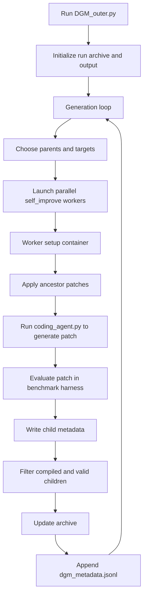
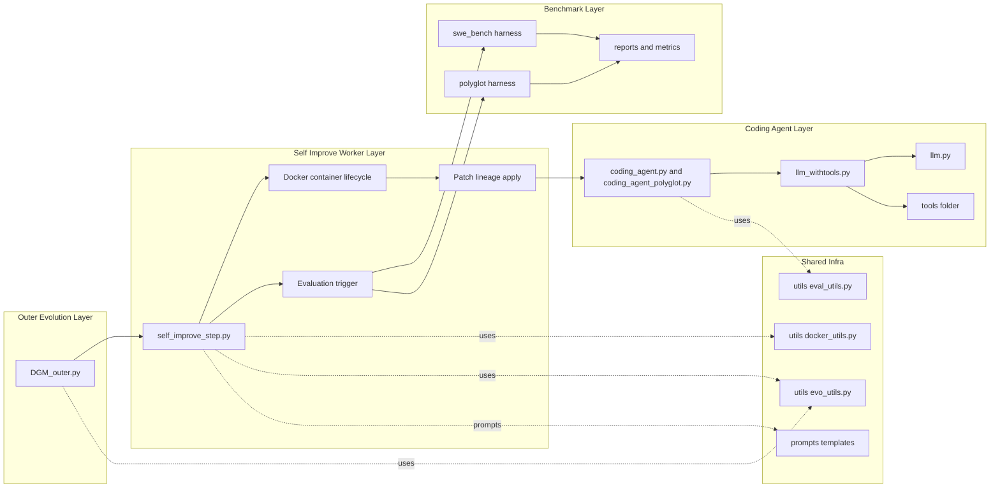
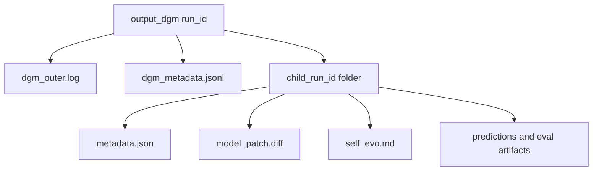

# DGM Architecture Diagram

This document gives a visual map of how Darwin Godel Machine (DGM) runs end-to-end.

## High-level flow

## High-level workflow elements explained

- **A. Run DGM_outer.py**  
  Starts the outer evolutionary process and parses run options (generation count, worker count, archive update mode, SWE vs Polyglot mode).

- **B. Initialize run archive and output**  
  Creates the run directory under `output_dgm/`, loads or seeds the archive, and prepares generation state.

- **C. Generation loop**  
  Main iteration loop. Each pass produces a new batch of candidate descendants from the current archive.

- **D. Choose parents and targets**  
  Selects which archived node(s) to mutate and what to improve (e.g., unresolved tasks, empty-patch handling, context-length issues).

- **E. Launch parallel self_improve workers**  
  Spawns multiple independent self-improvement attempts concurrently, each trying to create one child patch.

- **F. Worker setup container**  
  Inside each worker, builds/reuses Docker image and starts an isolated container to safely run code edits and evaluation.

- **G. Apply ancestor patches**  
  Reconstructs the selected parent state by applying lineage patches in order so the child starts from that exact inherited version.

- **H. Run coding_agent.py to generate patch**  
  Calls the coding agent in-container; the agent uses tool-calling LLM logic to modify code and emit `model_patch.diff`.

- **I. Evaluate patch in benchmark harness**  
  Runs SWE-bench or Polyglot harness to measure task resolution and produce objective fitness metrics.

- **J. Write child metadata**  
  Stores per-child outputs (`metadata.json`, patch, chat/eval logs) for traceability and later archive decisions.

- **K. Filter compiled and valid children**  
  Discards runs that are invalid (e.g., empty/non-compiling outcomes or incomplete eval structure).

- **L. Update archive**  
  Adds accepted children to the archive according to policy (`keep_all` or `keep_better`).

- **M. Append dgm_metadata.jsonl**  
  Logs generation-level summary (entries tried, children produced, accepted children, resulting archive), then loops back to **C**.

## Component map

## Output structure (what gets written)

## Reading guide

- `DGM_outer.py` decides **which descendants to try next**.
- `self_improve_step.py` creates one descendant and measures it.
- `coding_agent*.py` + `llm_withtools.py` perform **actual code modification**.
- Harnesses (`swe_bench/`, `polyglot/`) provide **fitness signals** used for archive updates.
